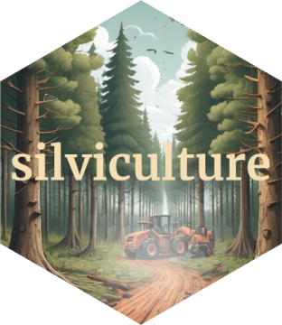

# silviculture <a href="https://github.com/Cidree/silviculture"></a>

<!-- badges: start -->

[](https://CRAN.R-project.org/package=silviculture) [](https://lifecycle.r-lib.org/articles/stages.html#experimental) [](https://app.codecov.io/gh/Cidree/silviculture) [](https://www.gnu.org/licenses/gpl-3.0)

<!-- badges: end -->

`silviculture` is an R package designed to streamline the analysis of forestry and forest inventory data, offering a range of functions for common silvicultural analysis. It aims to support forest management and research by providing a flexible toolkit for data manipulation and summary.

## Installation

You can install the development version of `silviculture` from [GitHub](https://github.com/) with:

``` r
# install.packages("pak")
pak::pak("Cidree/silviculture")
```

## Roadmap

This package is currently under active development and may still contain bugs or unstable features. I do not recommend using it in real-world applications at this stage, as it may be prone to errors.

## Nomenclature

The package uses the following terms as function arguments consistently:

* `biomass`: mass of the tree or part of the tree in kilograms.

* `dclass`: the diametric class of the tree. In forestry we typically work with diametric classes instead of raw diameters. Therefore, we often create diametric classes with a range of 5 or 10 centimeters.

* `diameter`: diameter of the tree, typically refering to the diameter at breast height (1.30 meters) expressed in centimeters.

* `h0 (dominant height)`: the mean height of the 100 thickest trees per hectare (Assman); or the mean height of the 100 tallest trees per hectare (Hart).

* `g (basal area)`: the basal area of the tree, which is typically expressed by the symbol `G`. It is expressed as squared meters per hectare ( m^2^/ha).

* `height`: it refers to the total height of the tree in meters.

* `Lorey's height`: tree's mean height weighted by basal area.

* `ntrees`: number of trees (typically of the same diameter).

* `species`: Latin name of the tree species (e.g. *Pinus pinaster*).

* `volume`: estimated volume of the tree in cubic meters (m^3^).

## Contributing

Contributions to `silviculture` are highly appreciated! If you have ideas for improvements or new features, feel free to:

-   Open an [issue](https://github.com/Cidree/silviculture/issues) for bugs or feature requests.

-   Submit a [pull request](https://github.com/Cidree/silviculture/pulls) for code contributions.

-   Share feedback on usage, examples, or additional functionality.

## License

This project is licensed under the GPL-3 License.
